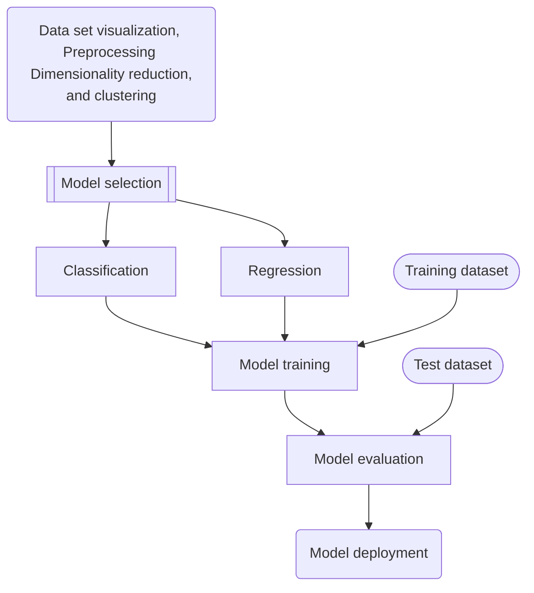

__Machine learning overview__

_homl3 ch1-2_


An appetizing question: what is a cat?
---
- 


What is machine learning (ML)?
---
- Conventional computer algorithms solve problems with explicit instructions
- ML solves problems without explicit instructions
  - using generalizable statistical algorithms
  - based on mathematical optimization


ML is a subfield of AI
---
- 
- ML contains the contemporary hot field Deep Learning (DL)
- Data mining overlaps many topics of ML, but focusing on exploring data patterns through unsupervised learning


ML typical problems
---
- classification: identifies which category an object belongs to
  - image recognition, credit card frauds
- regression: predicts a continuous-valued quantity in a phenomena
  - weather prediction, stock price prediction
- clustering: groups similar objects into sets
  - market segmentation, mushroom categorizing
- dimensionality reduction: finds the key features or factors of a problem
  - feature selection, principal component analysis (PCA)


ML learning methods classified by generalization
---
- Instance-based
  - remembers the examples
  - generalize to new cases by comparing them to the learned examples
    - by measuring their similarity
- Model-based
  - builds a general model of the examples


ML learning methods classified by supervision
---
- Supervised learning
  - the ML model is trained with example inputs and desired outputs
  - the goal is to learn a _general rule_ that maps inputs to outputs
- Unsupervised learning
  - only example inputs are given to the ML model
  - the goal is to discover _patterns or structures_ in the inputs
- Semisupervised learning
  - a combination of 
    - supervised learning finds the pattern
    - and unsupervised learning names or labels the pattern
- Reinforcement learning
  - a set of environment, actions and rewards are given to the RL model or agent
  - the goal is to learn _an optimal policy_ that maximizes rewards


ML models
---
- architectures with trainable or adjustable parameters
- popular ML models
  - Artificial neural networks (ANNs)
  - Decision trees
  - Support-vector machines
  - Regression analysis
  - Bayesian networks
  - Gaussian processes
  - Genetic algorithms
  - Belief functions


ML flow
---



Model training
---
- searches for an _optimal value for the model parameters_
  - that the model will _generalize_ well to new data
- minimizes a cost function that measures the model prediction accuracy
- applies a regularizer to constrain the model complexity
- Batch learning
  - trained with all the available offline data
  - also called offline learning
  - needs to be trained again for new data sets
- Online learning
  - trained incrementally with mini-batches of data
  - adapts to change rapidly and autonomously


ML challenges
---
- Insufficient quantity of training data
  - Poor-quality data
- Nonrepresentative training data
  - Irrelevant features
  - Data mismatch between training and production environment
- Overfitting the training data with complex models
  - performs great on the training data but poorly on new data
- Underfitting the training data with simple models
  - performs poorly on both the training data and new data


📝 Practice
---
- [Roadmap of choosing the right model](https://scikit-learn.org/stable/tutorial/machine_learning_map/index.html)


[AI concentration](https://catalog.floridapoly.edu/preview_program.php?catoid=31&poid=1357)
---
- foundation and overview course
  - [x] CAP 4612 - Machine Learning
- concentration courses
  - [ ] CAP 4630 - Artificial Intelligence Credits: 3
  - [ ] CAP 4613 - Applied Deep Learning Credits: 3
  - [ ] CAP 4410 - Computer Vision Credits: 3
  - [ ] CAI 4304 - Natural Language Processing Credits: 3
- elective courses
  - [ ] CAP 4770 - Data Mining & Text Mining Credits: 3
  - [ ] CAP 4786 - Topics in Big Data Analytics Credits: 3
  - [ ] CAP 3774 - Data Warehousing Credits: 3
  - [ ] ESI 4011 - Data Analytics for Smart City & Transportation Credits: 3
  - [ ] ESI 4513 - Intelligent Mobility Credits: 3
  - [ ] COP 4421 - Autonomous Systems Programming Credits: 3
  - [ ] EEL 4660 - Autonomous Robotic Systems Credits: 3


Prerequisites
---
- Scientific programming in Python
  - Numpy
  - Matplotlib
  - Pandas
- Mathematical foundation
  - Linear algebra
  - Differential calculus
  - Statistics


💡 Demo: Setup the ML environment
---
- Online environment
  - [Google Colab](https://colab.research.google.com/)
  - [Kaggle](https://www.kaggle.com/)
- Local environment
  - [Download and install Miniconda](https://docs.conda.io/projects/miniconda/)
  - create a virtual Python environment and install scikit-learn
    ```bash
    # 1. create a Python virtual environment named ml
    conda create -n ml python=3

    # 2. activate ml
    conda activate ml

    # 3. install required packages
    conda install -c conda-forge scikit-learn numpy scipy matplotlib ipython jupyter pandas sympy nose scikit-image

    # 4. deactivate ml and quit
    conda deactivate
    exit
    ``` 

📝 Practice
---
- 