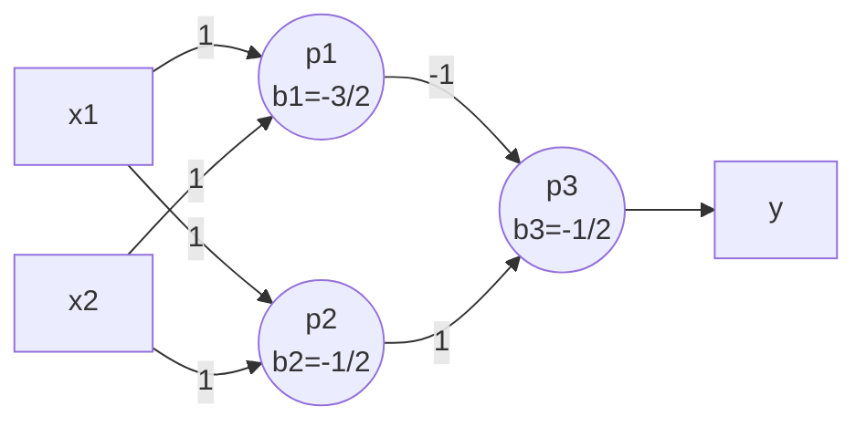
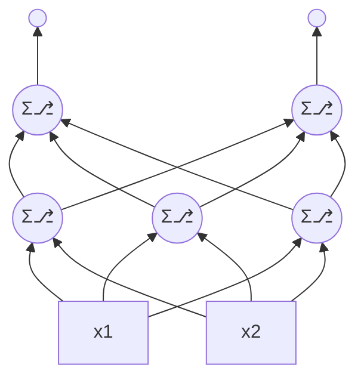
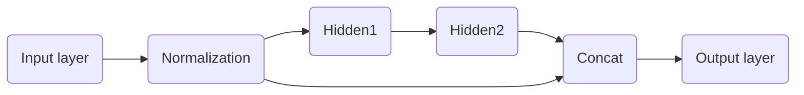
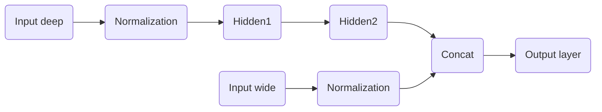
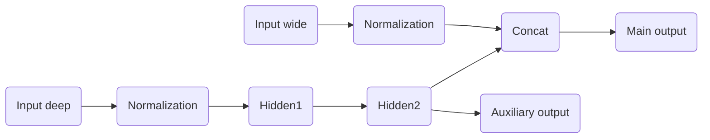

fig1: an MLP that can solve the XOR classification problem
---

fig2: A typical MLP
---

fig3: wide & deep nn
---

fig4: wide & deep nn with multiple inputs
---

fig5: wide & deep nn with multiple inputs & multiple outputs
---

